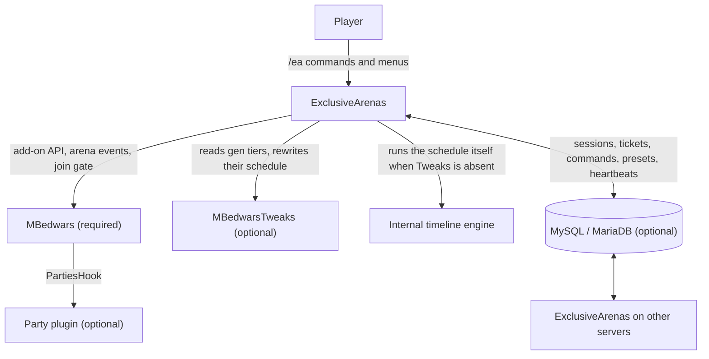
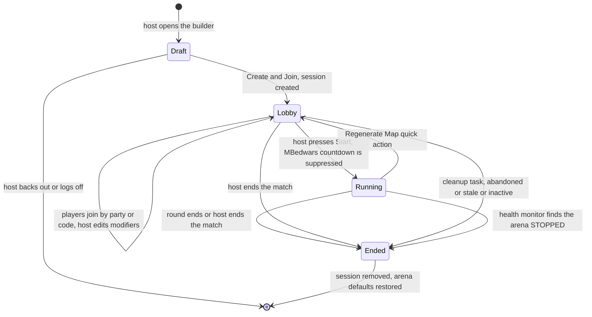
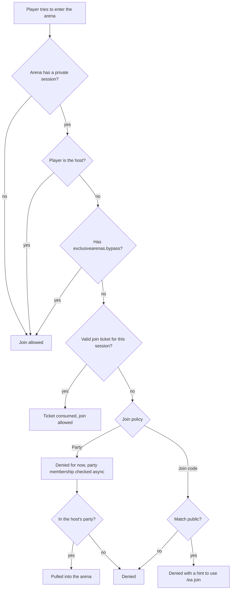
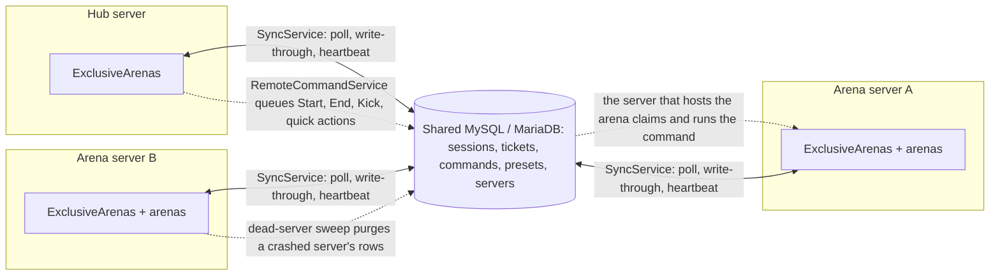

# ExclusiveArenas

<div align="center">

<a href="https://ko-fi.com/bkrbnkr"></a>

</div>

An [MBedwars](https://mbedwars.com/) add-on for Paper 1.21 that lets players host private BedWars
matches. A match is gated to the host's party or to a join code, and the host manages it from an
in-game GUI: an editable event timeline, per-match shop overrides, team size, match rules, time
and weather, saved configurations, and a set of one-click quick actions. It runs on a single
server out of the box, or across a network through its own MySQL/MariaDB database with automatic
cleanup after a crashed server.

## Table of contents

- [Requirements](#requirements)
- [Installation](#installation)
- [Permissions](#permissions)
- [Commands](#commands)
- [How it fits together](#how-it-fits-together)
- [Hosting a private match](#hosting-a-private-match)
  - [Joining a private match](#joining-a-private-match)
  - [Match controls](#match-controls)
  - [Event timeline](#event-timeline)
  - [Shop overrides](#shop-overrides)
  - [Team size](#team-size)
  - [Environment (time and weather)](#environment-time-and-weather)
  - [Saved configurations (presets)](#saved-configurations-presets)
  - [Spectating](#spectating)
- [Custom lobby hotbar items](#custom-lobby-hotbar-items)
- [Boss bar](#boss-bar)
- [Session cleanup](#session-cleanup)
- [Stability and health monitoring](#stability-and-health-monitoring)
- [Hiding private arenas from MBedwars' ArenasGUI](#hiding-private-arenas-from-mbedwars-arenasgui)
- [Network (multi-server) setup](#network-multi-server-setup)
- [Known limitations](#known-limitations)
- [Configuration reference](#configuration-reference)
- [Building from source](#building-from-source)
- [Versioning](#versioning)
- [Support](#support)

---

## Requirements

| Dependency | Version | Required |
|---|---|---|
| [Paper](https://papermc.io/) | 1.21.x (built against the 1.21.4 API; earlier versions are untested) | Yes |
| Java | 21+ | Yes |
| [MBedwars](https://mbedwars.com/) | 5.5.x (built against 5.5.6). ExclusiveArenas registers as a real MBedwars add-on | Yes |
| [MBedwarsTweaks](https://www.spigotmc.org/resources/mbedwars-tweaks.98926/) | 5.0.x (built against 5.0.2). If installed, the event timeline drives Tweaks' own gen-tier schedule so the scoreboard's next-event timer stays accurate. See [Event timeline](#event-timeline) | Optional |
| Party plugin | Any plugin with an MBedwars `PartiesHook` implementation. Needed for party-gated matches; without one every match is join-code gated | Optional |
| MySQL / MariaDB | Any recent version. Only needed for multi-server networks, see [Network setup](#network-multi-server-setup). The JDBC driver and connection pool are bundled | Optional |

---

## Installation

1. Drop `ExclusiveArenas-1.2.0.jar` into `plugins/MBedwars/add-ons/`.
2. Restart the server.
3. Edit `plugins/MBedwars/add-ons/ExclusiveArenas/config.yml` as needed, then run `/ea reload`
   (admin) to apply changes without a restart.

The config is self-healing: any key missing from your copy (for example after an update) is
restored with its default value on startup, and every key is commented inline.

---

## Permissions

| Permission | Default | Description |
|---|---|---|
| `exclusivearenas.command` | `true` | Use `/ea` commands |
| `exclusivearenas.bypass` | `op` | Bypasses join restrictions only: enter any private arena without a code or party, and stay exempt from a host's team lock. Grants no management access over anyone's match (that is `exclusivearenas.admin`) |
| `exclusivearenas.admin` | `op` | Admin panel, control any match, `/ea reload` |
| `exclusivearenas.limit.<n>` | none | Host up to `<n>` private matches at once (for example `exclusivearenas.limit.5`). The highest granted number wins; falls back to `private.default_arena_limit` (default `1`) if none is granted |
| `exclusivearenas.limit.unlimited` | `false` | No cap on hosted matches |

---

## Commands

| Command | Description |
|---|---|
| `/ea` or `/ea menu` | Open the main menu |
| `/ea arena` (or `create`, `builder`) | Jump straight to the match builder |
| `/ea arena <map> [nojoin]` | Skip the builder and create a match on `<map>` right away; `nojoin` creates it without joining |
| `/ea list` (or `arenas`) | Open Arena Management, the list of matches you host |
| `/ea help` | In-game help panel |
| `/ea join [code]` | Join a private match by its join code. If your party's leader hosts a party-gated match, you are sent there instead, code or not |
| `/ea lobby` (or `controls`) | Open Match Controls for the match you are standing in |
| `/ea start` | Start the match now (host only, works remotely) |
| `/ea end` | End the match (host only, works remotely) |
| `/ea summon` | Summon your whole party into the match (party policy, host only) |
| `/ea goto` | Go to your arena (grants yourself a join ticket first) |
| `/ea kick [keephost]` | Kick every player and spectator; `keephost` leaves you in the match |
| `/ea code` | Regenerate the join code (join-code policy) |
| `/ea public [on\|off]` | Open or lock joining by code (join-code policy) |
| `/ea team <player> <team>` | Move a lobby player onto a team (arena's own server only) |
| `/ea teamsize <amount\|reset>` | Change how many players fit on each team this match |
| `/ea weather <clear\|rain\|off>` | Set the arena's weather |
| `/ea time <noon\|sunset\|night\|off>` | Set the arena's time of day |
| `/ea regen` | Regenerate the map, keeping everyone in the match on their teams |
| `/ea heal` | Heal every player in the match |
| `/ea drop` | Make every generator drop now |
| `/ea beds` | Sudden death: destroy every remaining bed |
| `/ea clearitems` | Clear all dropped items |
| `/ea skipevent` | Fire the next timeline event now |
| `/ea balance` | Re-shuffle everyone evenly across the enabled teams |
| `/ea trigtrap` | Force-trigger a random team's queued trap |
| `/ea cleartraps` | Clear every team's queued traps |
| `/ea resetupgrades` | Reset every team's generator and shop upgrades |
| `/ea freeze` | Toggle locking everyone in the arena in place |
| `/ea rejoinall` | Rejoin any disconnected players who are back online |
| `/ea forcewin <team>` | End the match now and award `<team>` the win |
| `/ea swapteams <team-a> <team-b>` | Swap two teams' rosters |
| `/ea buff <speed\|jump\|regen\|strength\|potion_type> [amplifier] [seconds]` | Give everyone in the arena a timed potion effect |
| `/ea border` | Show yourself the arena's match-area border |
| `/ea timeline list\|add\|custom\|move\|set\|delete\|reset` | Edit this match's event timeline, see [Event timeline](#event-timeline) |
| `/ea shop list\|disable\|enable\|price\|resetprice\|reset` | Edit this match's shop, for example `/ea shop disable blocks-wool` or `/ea shop price blocks-wool 8 iron` |
| `/ea preset list\|save\|apply\|delete` | Saved configurations, for example `/ea preset save sweats` and `/ea preset apply sweats` |
| `/ea admin` | Admin panel listing every active match on the network (`exclusivearenas.admin`) |
| `/ea reload` | Reload config, reconnect the database, resync sessions (`exclusivearenas.admin`) |

Every host command (`start`, `end`, `summon`, `kick`, the quick actions, the editors) works when
you are not standing in your arena. It falls back to the match you host, or on a network relays
the request to the server that hosts the arena (see [Remote control](#remote-control)).

---

## How it fits together

ExclusiveArenas sits on top of MBedwars and talks to everything else through it. This shows
which parts are required, which are optional, and how a network setup shares state.



- **MBedwars** is the only hard dependency. The plugin registers as a `BedwarsAddon`, listens to
  MBedwars' arena and join events, and gates joins by adding an issue to the join event.
- **Party plugin**: party membership is looked up through MBedwars' `PartiesHook`, so any party
  plugin MBedwars supports works. With no hook present every match is join-code gated.
- **MBedwarsTweaks**: when present (and `timeline.backend` is `auto`), the timeline editor
  reads Tweaks' gen tiers as its defaults and rewrites Tweaks' scheduling for private matches.
  Otherwise an internal engine runs the schedule from `config.yml`.
- **Database**: when `database.enabled` is true, sessions, join tickets, remote commands, presets
  and server heartbeats live in the plugin's own MySQL/MariaDB tables. Every server polls them
  and writes through, so a match is visible and controllable from anywhere on the network.

On startup the plugin logs one line describing what it found (parties hook, RemoteAPI,
MBedwarsTweaks and which timeline backend engaged).

---

## Hosting a private match

1. Run `/ea`. The main menu's first button depends on context: **Create New Arena** while you
   host nothing, **Match Controls** while you host your single allowed match, and **Arena
   Management** only when your limit allows several matches. `/ea arena` always opens the
   builder.
2. The join policy is set automatically from your party status when you open the builder:
   - Leading a party: **Party Only**. Only your party members may join.
   - Not in a party: **Join Code**. Players join with `/ea join <code>`.
   - In a party but not its leader: the builder is locked. Join your leader's match instead.
   - Leading a party in which someone else already hosts a match: locked until their match ends
     or they leave the party.

   A party-gated match does not outlive its party. If the host leaves the party or loses
   leadership, the match converts to a join-code gate (checked every
   `private.party_check_seconds`). The host gets the fresh code, the arena is told, and the
   match stays locked until the host opens it with `/ea public on`.

   Hosting several matches at once (a higher `exclusivearenas.limit.<n>`) is only allowed
   while every one of them is join-code gated. A party-gated match is always its host's only
   match.
3. Click **Select Map** and pick an arena. Entries show the arena's own MBedwars icon and can be
   filtered by team count and players per team. Picking one soft-reserves it for you until you
   create the match, back out, or leave the menu (the reservation expires after 10 minutes).
4. Optionally open **Arena Modifiers** to set up the [event timeline](#event-timeline),
   [shop items](#shop-overrides), [team size](#team-size) and [match rules](#match-rules)
   before the match exists. These are the same editors as Match Controls, working on your draft.
5. Click **Create & Join** to create the match and be sent in, locally or across servers.
   Shift-click creates it without joining (you get a ticket, so **Go to Arena** still works
   later). Use **Summon Party** in Match Controls, or the
   [party-summon lobby item](#custom-lobby-hotbar-items), to pull your party in.

You cannot open the builder while inside one of your own private matches. Leave it first.

This is the life of a session, from the builder to cleanup.



The draft lives in memory until the session is created or the player logs off. The session is
created by `PrivateSessionService`, the lobby is gated by `JoinListener`, and the session ends
on MBedwars' round-end event, the host's End Match, `SessionCleanupTask`, or the health monitor.

### Joining a private match

Players never pass the gate by walking in. Every allowed join goes through a short-lived
**join ticket** (default 30 seconds, `private.ticket_ttl_seconds`), granted by `/ea join`, a
party summon, `/ea goto`, or the auto-routing that sends a party member to their leader's
match when they log in. Join codes use letters and digits without `0`, `O`, `1` or `I`
(`private.join_code_length`, default 6, minimum 4), and repeated wrong codes are throttled.

This is what happens when a player tries to enter a private arena.



The party check is asynchronous while MBedwars' join event is not, so a party member is denied
first and then summoned once the hook confirms them. A join arriving from another server
cannot be party-checked at all, so it always needs a ticket. Spectator joins go through the
same gate.

### Match controls

Open via the arena's entry in **Arena Management**, `/ea lobby`, or the host-only
[lobby hotbar item](#custom-lobby-hotbar-items):

- **Start Match**: begins the round now. MBedwars' own lobby countdown is suppressed, so the
  match only starts when you press this. Needs at least one other player in the arena.
- **Join Policy**: shows the current policy and lets you switch it on a created match.
- **Public / Locked** (code policy) or **Summon Party** (party policy).
- **Regenerate Code** (code policy): invalidates the old code and issues a new one.
- **Manage Teams**: move players between teams, lock team selection, and change the per-team
  size in the lobby (see below). Only on the arena's own server, since MBedwars does not expose
  per-player team data remotely.
- **Go to Arena**: teleport or connect to the match yourself.
- **Kick All Players**: clears the arena; shift-click keeps you in it.
- **Arena Modifiers**: opens [Event Timeline](#event-timeline), [Shop Items](#shop-overrides),
  [Team Size](#team-size), [Match Rules](#match-rules),
  [Environment](#environment-time-and-weather) and
  [Saved Configurations](#saved-configurations-presets). Each button's lore has a one-line
  summary of what this match has changed. Timeline, shop, team size and match rules are editable
  before the match starts; timeline and shop again once it is running, taking effect from the
  next round, and match rules changes also wait for the next round. Environment is editable at
  any time.
- **Quick Actions**: one-click shortcuts built on the stable MBedwars API. Most work on a
  running match; team, trap and upgrade actions work any time:
  - **Regenerate Map**: rebuilds the arena without anyone leaving. Everyone becomes a
    spectator (teams snapshotted first) so the round ends and MBedwars regenerates the map;
    once the arena is back in its lobby everyone is re-added on their old team, and the round
    restarts if `quick_actions.restart_after_regen` is on (default).
  - **Heal Everyone**: full health and hunger, extinguishes fire.
  - **Trigger All Generators**: every generator drops now.
  - **Sudden Death**: destroys every remaining bed.
  - **Clear Ground Items**: removes every dropped item.
  - **Skip to Next Event**: fires the next timeline event now.
  - **Force Win**: pick a team from a sub-menu to end the match with them as winners.
  - **Swap Teams**: the menu item points you at `/ea swapteams <team-a> <team-b>`.
  - **Balance Teams**: re-shuffles everyone evenly across the enabled teams.
  - **Trigger Random Trap**: force-triggers a random team's queued trap, if any.
  - **Clear Trap Queues**: clears every team's queued traps.
  - **Reset Team Upgrades**: resets every team's generator and shop upgrades.
  - **Buff Everyone**: Speed II, Jump Boost II, Regeneration II or Strength II for 60 seconds.
    `/ea buff` also accepts any Bukkit potion type with a custom amplifier and duration.
  - **Freeze / Unfreeze All**: locks everyone in place (looking around still works).
  - **Force-Rejoin Disconnected**: rejoins players who disconnected mid-match and are back.
  - **Reveal Arena Border**: shows you (only you) the match-area border. Arena's own server
    only.
  - **+2:00 / -2:00 Match Timer**: nudges the match-end countdown, never below 0:30.
  - **Toggle PvP**: blocks or restores all player damage, friend or foe.
  - **Strip Inventories**: clears everyone's inventory and armor.
  - **Comeback Buff**: Strength II and Resistance II for 60 seconds to the team with the fewest
    players.
  - **Random Scatter**: teleports everyone to a random spot inside the arena's region.
  - **Kick AFK Players**: removes anyone who has not moved in
    `quick_actions.afk_kick_threshold_seconds` (default 120). A player never seen moving is
    never kicked.
  - **Reset Shop Prices**: clears every price and disable override for this match.
  - **Give Tracking Compass**: hands everyone a compass pointed at their nearest enemy, as a
    one-time snapshot.
  - **Announce Match Stats**: broadcasts each team's alive or eliminated status and kills.
  - **Emergency Pause**: freezes everyone and holds every pending timeline event until resumed
    (pending events shift by the length of the pause). MBedwars' own match-end clock keeps
    counting; there is no public API to stop it.
- **End Match**: closes the session and kicks everyone, players and spectators alike.

#### Match rules

A grid of standing per-match toggles, separate from the one-shot [event timeline](#event-timeline).
Click a rule to cycle its value, **Reset All Rules** to return to vanilla. Changes apply from
the next round start:

- **Friendly Fire**: teammates can damage each other.
- **Fall Damage**: off disables fall damage.
- **Explosion Block Damage**: off keeps explosions from breaking blocks.
- **Kill Bounty** (0/1x/2x/3x): resources handed to a killer on top of the normal drop
  (`arena_modifiers.kill_bounty` sets the resource and 1x amount).
- **Shop Prices** (Normal/Half Price/+50%/Double): scales every shop price.
- **Bonus Starting Kit**: extra items everyone spawns with (`arena_modifiers.starting_kit.items`).
- **PvP Grace Period** (Off/15s/30s/60s): no PvP damage for this long after the start.
- **Health Multiplier** (Normal/1.5x/2x/0.5x): scales everyone's max health.
- **World Border Shrink**: shrinks the playable area over time (`arena_modifiers.world_border`
  sets target size and duration). Assumes one game world per arena, MBedwars' default; with
  several arenas in one world the border would shrink for all of them.
- **Bed Respawn Once**: each team's bed survives its first hit.
- **Spawn Protection** (Off/5s/10s/20s): no PvP damage near a player's own team spawn right
  after they respawn (`arena_modifiers.spawn_protection.radius`).
- **Kill Goal** (Off/10/20/30): first team to reach this many kills wins.

#### Manage teams

Click a team to see its roster and open the player picker: every player in the arena not
already on that team shows as a head. A plain click moves that one player; shift-click stages
several (shown with a glint) for a batch move via **Move N Selected Player(s)**. Clicking a
staged head un-stages it. Selecting more than the team has room for turns the title into a
warning until you free a slot.

**Distribute Players** shuffles and re-splits everyone in the lobby evenly across the enabled
teams, respecting capacity.

**Lock Teams** freezes team selection for everyone but you: the team menu refuses to open for
them, and a player moved onto another team by any other route is put straight back. You keep
moving anyone from this menu, and admins (`exclusivearenas.admin` or `.bypass`) are exempt.
Everyone is told when you lock or unlock, and a player who tries to switch is told why they
cannot. The lock only applies in the lobby and travels with the match's settings, so it holds on
the arena's own server even when toggled from a hub.

**Team Size** (bottom-left) is the same editor as [Team size](#team-size) under Arena Modifiers.

### Event timeline

Each event fires this many minutes into the match, left to right. Click one to select it, then
nudge it by 1 minute or 5 seconds, or delete it. Match End can be moved but never deleted;
shortening it rescales every other event to fit. Match End's lore shows the total match time.

The editor also has:

- a **schedule summary** card: event count, match length, how many of your 15 custom-event
  slots are used, and whether timings are still the server's defaults;
- a **detail card** for the selected event: type, target, effect and exact time;
- **Duplicate Event**: schedules the same thing again just after the original (not for
  generator upgrades or Match End);
- **Change What It Does**: re-runs the value step of the wizard on an event you built;
- **Clear All Events** (Match End stays) and **Reset to Defaults**;
- **paging** for schedules longer than one screen.

Backends:

- **Without MBedwarsTweaks**: events come from `timeline.events` in `config.yml`: generator
  speed-ups, a bed-destruction event, and exactly one `match_end` event, plus the optional
  catalog entries. The internal engine runs the schedule from match start.
- **With MBedwarsTweaks**: the editor's defaults come from Tweaks' gen-tier chain, and a host's
  custom timings are applied by rewriting Tweaks' scheduling live, so Tweaks still runs the
  schedule and its scoreboard placeholders stay accurate. Tweaks' Sudden Death tier spawns
  dragons but never registers a bed as destroyed with MBedwars, so if a custom timeline could
  reach Sudden Death without a real bed-break, ExclusiveArenas forces one at that moment. Event
  types with no Tweaks gen-tier equivalent (weather, buffs, announcements and so on) are
  skipped on this backend. Set `timeline.backend: internal` if you want them to fire alongside
  Tweaks.
- **Match length is capped** at `timeline.max_match_time` (default `60:00`). Match End cannot be
  pushed past it from the GUI or the commands.
- Also editable via `/ea timeline list|add|custom|move|set|delete|reset`.

#### Adding events

**Add Event** lists every catalog event not currently on this match's timeline, either deleted
earlier or defined with `default: false` in `config.yml` as an optional extra. Click one to add
it at its default time, or shift-click to pick the time first.

**Build Your Own Event** (bottom of Add Event) walks through three steps: what it does, what it
applies to (resource, effect, weather or time of day; buffs also get strength and duration,
announcements are typed into an anvil), and when it fires. The same events can be created from
the command line:

```
/ea timeline custom <type> [value] <time>
```

| Type | Value | Effect |
|---|---|---|
| `resource_burst` | a drop type id (for example `diamond`) | One-time bonus drop from every generator of that type |
| `team_buff` | `POTION_TYPE:amplifier:seconds` (for example `SPEED:1:30`) | Timed potion effect for everyone in the arena |
| `trap_chaos` | none | Force-triggers a random team's queued trap, if any |
| `weather_change` | `CLEAR`, `RAINING` or `UNTOUCHED` | Scripted weather change |
| `time_change` | `NOON`, `SUNSET`, `NIGHT` or `UNTOUCHED` | Scripted time-of-day change |
| `announcement` | any message | Broadcast only, no gameplay effect |
| `fireworks` | none | Firework show over the arena |
| `heal_all` | none | Fully heals and feeds every player |
| `clear_items` | none | Removes every dropped item |
| `balance_teams` | none | Re-shuffles everyone evenly across the enabled teams |
| `clear_traps` | none | Clears every team's queued traps |
| `reset_upgrades` | none | Resets every team's upgrades |

Custom events are capped at 15 per session. From the command line, reference them by the id
`/ea timeline list` shows.

### Shop overrides

Disable individual shop items for this match, or change what they cost (amount and currency),
from Arena Modifiers > **Shop Items**. Click an item to toggle it; shift-click opens the price
editor. Also editable via `/ea shop list|disable|enable|price|resetprice|reset`. Disabled items
show as red dye wherever the shop is opened, including MBedwars' Quick Buy page, or are hidden
entirely with `shop.disabled_display: remove`.

### Team size

Change how many players fit on each team from Arena Modifiers > **Team Size**, Match Controls >
Manage Teams > **Team Size**, or `/ea teamsize <amount|reset>`. Editable for the whole lobby
phase and locked once the match is running. Changing it while players already hold teams
unassigns everyone from their team (they stay in the lobby) with a message explaining why. The
override is temporary; the arena's own value is restored when the match ends.

### Environment (time and weather)

Set the arena's time of day and weather from Arena Modifiers > **Environment**, or with
`/ea weather <clear|rain|off>` and `/ea time <noon|sunset|night|off>`. This is a per-player
visual effect with no gameplay impact, so it is editable at any time and applies to everyone in
the arena plus anyone who joins later. It resets when the match ends. The same changes are
available as scripted [timeline events](#event-timeline) (`weather_change`, `time_change`).

### Saved configurations (presets)

Snapshot a match's setup (event timeline, shop overrides, team size, match rules and
environment) as a named preset from Arena Modifiers > **Saved Configurations**. Click a preset
to apply it, right-click to preview it, shift-click to delete it.

**Preview** shows every scheduled event, the disabled and repriced shop items, the team size,
the changed match rules, the environment, and a *What would change* card against the current
setup. Whether teams are locked is not part of a preset, since that is live lobby state.

**Save Current Setup** opens an anvil to type the name; take the result item to confirm. Also
available via `/ea preset list|save|apply|delete`. Capped at 20 presets per player; names are
1 to 24 characters of letters, digits, `-` and `_`. Presets are stored in `presets.yml` in the
add-on folder, or in the shared database on a network so they follow you across servers.

### Spectating

- Joining a join-code match that is already running spectates you instead of failing.
- The [spectate lobby item](#custom-lobby-hotbar-items) lets an active player opt out of
  playing right away, freeing their slot. It disappears once they are spectating.
- The [rejoin lobby item](#custom-lobby-hotbar-items) lets a spectator switch back to playing
  while the arena is still in its lobby and has a free slot.

---

## Custom lobby hotbar items

ExclusiveArenas registers four MBedwars lobby hotbar item handlers. Registering only makes a
handler available by id; nothing appears until you add an entry referencing it to your live
`lobby-hotbar.yml` under `plugins/MBedwars/configs/` (see MBedwars' docs for the exact versioned
path). The slot is yours; name and item are placeholders, since every handler overrides its own
icon, name and lore at render time. All four only appear inside a private match.
`toggle-spectate` and `rejoin-as-player` are mutually exclusive, so they can share a slot.

```yaml
open-controls:
  name: '&eMatch Controls'
  slot: 2
  handler: 'exclusivearenas:open_controls'    # visible only to the match's host
  item: 'command_block'

toggle-spectate:
  name: '&7Spectate This Match'
  slot: 3
  handler: 'exclusivearenas:toggle_spectate'   # visible to any active player
  item: 'gray_dye'                             # hidden once they are spectating

rejoin-as-player:
  name: '&aRejoin as Player'
  slot: 3
  handler: 'exclusivearenas:rejoin_as_player'  # visible to any spectator
  item: 'lime_dye'                             # hidden once the round is running or full

summon-party:
  name: '&eSummon Party'
  slot: 4
  handler: 'exclusivearenas:summon_party'      # host only, party-gated matches only
  item: 'ender_pearl'
```

- `exclusivearenas:open_controls`: opens Match Controls for the host.
- `exclusivearenas:toggle_spectate`: converts an active player to a spectator immediately,
  leaving their team and freeing their slot.
- `exclusivearenas:rejoin_as_player`: lets a spectator switch back to playing. Only visible while
  the round is not running and the arena has a free slot.
- `exclusivearenas:summon_party`: pulls the host's online party members into the lobby, same as
  the **Summon Party** button.

---

## Boss bar

Everyone inside a private match's arena sees a boss bar stating that it is private, its current
join policy (the join code is hidden while the match is locked), and, while running, whether
the in-game timer is paused. Bukkit has no orange boss bar color, so it renders yellow with
gold text. Toggle with `private.bossbar_enabled`.

---

## Session cleanup

A background task (every 30 seconds) ends sessions that have been abandoned, gone stale, or
sat inactive, so forgotten matches do not pile up:

- **Abandoned**: the host left the lobby and has not returned within
  `private.host_abandon_timeout_minutes` (default 5). Ends with an in-arena broadcast.
- **Stale**: the session was created more than `private.stale_session_hours` ago (default 12)
  and the arena is not running anywhere on the network. A last-resort safety net.
- **Inactive**: the lobby has had zero active players (everyone spectating, or nobody ever
  joined) for `private.inactivity_warning_minutes` (default 10). Anyone in the arena, plus the
  host if online elsewhere, is warned; if it is still empty after
  `private.inactivity_close_grace_minutes` (default 5) the session ends. Set
  `inactivity_warning_minutes` to `0` to disable this check.

---

## Stability and health monitoring

A separate task (every `stability.health_check_seconds`, default 30) checks every active session
against MBedwars' live arena state and logs every corrective action it takes:

- A session whose arena has gone `STOPPED` outside the plugin (a crashed reset, a manual admin
  action) is ended instead of lingering.
- A match running longer than the timeline's match-length cap plus
  `stability.stuck_match_grace_seconds` (default 300) is logged as possibly stuck. It is only
  force-ended if `stability.force_end_stuck_matches` is on (default off).
- A generator whose drop timer stops ticking is flagged as a possible desync. Warn only.
- MBedwars' own arena configuration issues (missing bed, spawn, lobby) are logged as warnings.

This task never messages players, only the console.

---

## Hiding private arenas from MBedwars' ArenasGUI

ExclusiveArenas registers an MBedwars arena-picker condition variable named
`exclusivearenas_private` (`1` while an arena hosts a private match, else `0`). To keep private
lobbies out of MBedwars' own ArenasGUI, add a condition to the `arenas-collection` element(s) of
your live layout file(s) under `plugins/MBedwars/arenasgui-layouts/`:

```yaml
- type: arenas-collection
  condition: "[exclusivearenas_private=0]"
  area: ...
```

---

## Network (multi-server) setup

ExclusiveArenas runs single-server out of the box (fully in memory) or across any number of hubs
and arena servers, sharing state through its own MySQL/MariaDB database. It does not use
MBedwars' internal storage or its RemoteAPI messaging, since MBedwars exposes no general
cross-plugin messaging channel and may run on a non-shared SQLite backend.

1. Set up a MySQL/MariaDB database reachable from every server.
2. On every server (hubs and arena servers alike), set in `config.yml`:
   ```yaml
   server_id: "unique-per-server"   # must be distinct on every server
   is_hub_server: true              # only on hub/lobby servers
   database:
     enabled: true
     host: "..."
     port: 3306
     database: "exclusivearenas"
     user: "..."
     password: "..."
   ```
3. Every server mirrors all active sessions, tickets and commands by polling
   (`database.session_poll_seconds`, `ticket_poll_seconds`, `command_poll_seconds`), so a
   session created on one server is usable from any other.

The plugin creates five tables with the `database.table_prefix` (default `ea_`): `sessions`,
`tickets`, `commands`, `presets` and `servers`. This is how the servers relate.



**Arena names must be unique across the whole network.** Sessions are looked up by bare arena
name, so two arena servers each having an arena with the same name will collide (the second
overwrites the first's session row). Display names do not matter, only the MBedwars arena name.

With MBedwars' RemoteAPI active but the database disabled, remote arenas are hidden from the map
selector and refused by `/ea arena <map>`, because a private match on a remote arena could not
be gated on the server that hosts it.

### Remote control

A host can manage their match from a hub or another arena server:

- **Start Match**, **End Match**, **Kick All** and every quick action are queued in the shared
  database when you are not on the arena's server. Each server polls the queue and the one that
  has the arena loaded claims and runs the command. Commands older than 30 seconds are
  discarded instead of replayed.
- **Join Policy**, **Summon Party** and **Regenerate Code** never needed the arena to be local.
- **Manage Teams** is the exception. It needs the arena's own server, since MBedwars' RemoteAPI
  does not expose per-player team assignments.

Buttons whose action cannot run from the current server say so in their lore.

### Crash resilience

Every server stamps its own heartbeat row on every session poll. Every server also sweeps
(`database.dead_server_sweep_seconds`, default 120) for servers that have been quiet for
longer than `database.dead_server_after_seconds` (default 90) and purges their orphaned
sessions, tickets and commands. A session whose arena is still active somewhere on the network
is spared, and if that arena runs on the sweeping server the session is adopted under its own
`server_id`. Several servers can notice and purge the same dead server at once without harm.
Keep `dead_server_after_seconds` a generous multiple of `session_poll_seconds` (the default is
about 22x) so a slow poll is never mistaken for a crash.

### Party plugins across multiple hubs

Party gating relies on MBedwars' `PartiesHook`. If your party plugin is not itself
network-synced, a party split across two hubs will not be recognised as one party. That is a
property of the party plugin, not something ExclusiveArenas controls.

---

## Known limitations

- **Team management needs the arena's own server.** See [Remote control](#remote-control).
- **Arena names must be unique network-wide.** See [Network setup](#network-multi-server-setup).
- **`server_id` uniqueness is not validated.** Cloning a server's data folder without editing
  `server_id` does not break session logic, but corrupts attribution in the database.
- **No per-match cosmetic control.** MBedwars exposes no cosmetics API.
- **Auto-summon is not exposed anywhere.** The continuous party-sync task
  (`private.auto_summon_enabled`) exists but has no command or menu right now. Use
  **Summon Party** for a one-time pull.
- **Swap Teams has no GUI team picker.** It is `/ea swapteams <team-a> <team-b>` only.
- **Reveal Border only works on the arena's own server.** The particles are shown to you
  directly and cannot be relayed.
- **Locking teams cannot stop a plugin that reassigns teams outright.** MBedwars has no
  cancellable "player wants a different team" hook, so the lock refuses the team menu and puts
  anyone moved by another route back a tick later.
- **Arena names with whitespace break some features.** Several actions pass the arena name
  through dispatched commands (`/bw join`, the network join command template). The plugin warns
  about such arenas at startup.

---

## Configuration reference

See `config.yml`. Every key is commented inline, including the setup snippets referenced above.
`lang.yml` holds every chat message and `guis.yml` every menu layout.

---

## Building from source

The build uses Gradle with the shadow plugin. MBedwars and MBedwarsTweaks are not on a public
Maven repository, so their jars go in `libs/`:

1. Put `MBedwars.jar` and `MBedwarsTweaks-5.0.2.jar` in `libs/`.
2. Run the build:
   ```
   ./gradlew build
   ```
3. The plugin jar is at `build/libs/ExclusiveArenas-1.2.0.jar`. The MariaDB driver and HikariCP
   are shaded in and relocated under `com.slg.exclusivearenas.libs`.

---

## Versioning

- The plugin version follows [Semantic Versioning](https://semver.org/).
- `config.yml`, `lang.yml` and `guis.yml` are each versioned by their own `config-version`
  key. Each migrates and self-heals on startup: missing keys are restored with their bundled
  defaults, and values that still match an old default are moved forward where it makes sense
  (for example a moved menu button). You do not need to delete any of them when updating, and
  values you changed are preserved.

---

## Support

<div align="center">

This plugin is free and open source, and I work on it in my spare time.<br>
If it saved you some time, you can buy me a coffee. No pressure - the code stays free either way.

<a href="https://ko-fi.com/bkrbnkr"></a>

</div>

<!-- more ways to support go here -->
<!-- - [PayPal](...) -->
<!-- - [GitHub Sponsors](...) -->
